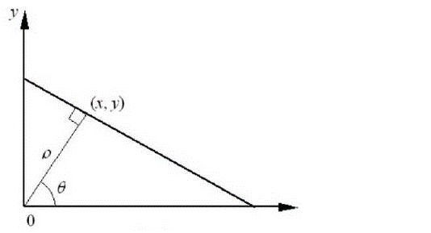

## 对霍夫变换的理解
将直角坐标系中的点变换到另一个空间，使得同一条直线上的点对应另一个变换空间上的
同一个点，该点累加器加一，该点的累加值越大，说明同一直线上的点越多。变换如下：
1. 做一条 经过(x,y)的直线 与 原点的垂线，则有垂线段的长ρ，以及夹角θ（ρ, θ）
2. 同一条直线上的点则有相同的垂线，亦对应相同的参数（ρ, θ）。
3. 直线的方程为 ρ=xcosθ+ysinθ

## opencv中直线检测函数

1. HoughLines   直线检测不包含端点
	+ //InputArray image：输入图像，必须是8位单通道图像。 
	+ //OutputArray lines：检测到的线条参数集合。 
	+ //double rho：以像素为单位的距离步长。 
	+ //double theta：以弧度为单位的角度步长。 
	+ //int threshold：累加计数值的阈值参数，当参数空间某个交点的累加计数的值超过该阈值，则认为该交点对应了图像空间的一条直线。
2. HoughLinesP 包含端点的直线检测（在1的基础上多两个参数）
	+ //double minLineLength：默认值为0，表示最小线段长度阈值（像素）。 
	+ //double maxLineGap：线段上最近两点之间的阈值.默认值为0，表示直线断裂的最大间隔距离阈值。即如果有两条线段是在一条直线上，但它们之间有间隙，那么如果这个间隔距离小于该值，则被认为是一条线段，否则认为是两条线段。
	+ //OutputArray lines：每一条直线由具有四个元素的矢量（x1, y1, x2, y2）表示，其中(x1, y1)表示线段的起点，(x2, y2)表示线段的终点。
## Mat 图像赋值中浅拷贝与深拷贝
1. 浅拷贝是 b = a;和 b(a);
2. 深拷贝是 b = a.clone(); 和 a.copyTo(b);
3. cv::Mat img_roi; img_roi = img(cv::Rect(400, 200, 100, 100)); 也是浅拷贝。[代码参考](https://blog.csdn.net/shyjhyp11/article/details/112717066)

## 灰度图像的实现
cv2.cvtColor(input_image,flag=cv2.COLOR_BGR2GRAY),
Gray = 0.29900×R + 0.58700×G + 0.11400×B

## 图像加法（cv2.add()）与图像融合（cv2.addWeighted()）
1. 图像加法：目标图像 = 图像1 + 图像2
2. 图像融合：目标图像 = 图像1 × 系数1 + 图像2 × 系数2 + 亮度调节量

## 图像滤波
1. 低通滤波器：去除图像中的高频部分——模糊化
2. 高通滤波器：去除图像中的低频部分——锐化
3. 线性滤波器：方框滤波、均值滤波、高斯滤波
4. 非线性滤波：中值滤波、双边滤波

## 插值算法
1. 近邻：寻找最近的一个点作为其值
2. 线性插值： 找最近的两个点，然后线性计算
3. 双线性插值（三次内插）： 找周围的最近的四个点，然后先两次X方向插值，然后一次Y方向插值。

## 传统图像分割算法
1. 多数的图像分割算法：均是基于灰度值的不连续和相似的性质。

2. 图像边缘分割：边缘是图像中灰度突变像素的集合，一般用微分进行检测。基本的边缘检测算法有：Roberts算子、Sobel算子、Laplacian、Scharr。稍高级的算法有：Canny边缘检测器。
	+ sobel 算子子图像的一阶导数
	
	+ Laplacian是对二维图像求的二阶偏导数，在函数中由于 Laplace使用了图像梯度，它内部调用了 Sobel 算子。
	
	+ Canny 图像降噪——计算图像梯度，得到可能边缘——非极大值抑制——双阈值筛选。edges cv.Canny( image, threshold1, threshold2, apertureSize, L2gradient)
	
	   image 为 8 位输入图像。
	   threshold1 表示处理过程中的第一个阈值，如果当前边缘像素的梯度值介于 maxVal 与 minVal 之间，则将当前边缘像素标记为虚边缘（需要保留），需要对其做进一步处理。一般通过判断虚边缘与强边缘是否连接，来确定虚边缘到底属于哪种情况。通常情况下，如果一个虚边缘：与强边缘连接，则将该边缘处理为边缘，与强边缘无连接，则该边缘为弱边缘，将其抑制。
	   threshold2 表示处理过程中的第二个阈值，如果当前边缘像素的梯度值大于或等于 maxVal，则将当前边缘像素标记为强边缘。
	   apertureSize 表示 Sobel 算子的孔径大小。
	   L2gradient 为计算图像梯度幅度（gradient magnitude）的标识。其默认值为 False。如果为 True，则使用更精确的 L2 范数进行计算（即两个方向的导数的平方和再开方），否则使用 L1 范数（直接将两个方向导数的绝对值相加）。
	
3. 图像阈值分割：由于阈值处理直观、实现简单且计算速度快，因此阈值处理在分割应用中处于核心地位。如Otsu（最大类间方差算法）算法。

4. 基于区域的分割：区域生长算法和区域分裂与聚合都是属于基于区域的分割算法。

5. 形态学分水岭算法
